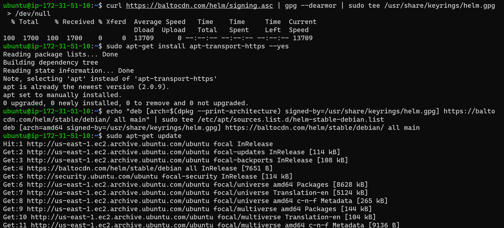

# BUILDING ELASTIC KUBERNETES SERVICE (EKS) WITH TERRAFORM AND DEPLOYMENT WITH HELM

View Terraform EKS cluster configuration files here

Install Helm on a Windows OS

```bash
choco install kubernetes-helm
```



