# BUILDING ELASTIC KUBERNETES SERVICE (EKS) WITH TERRAFORM AND DEPLOYMENT WITH HELM

View Terraform EKS cluster configuration files here

Install Helm on a Ubuntu OS

```bash
curl https://baltocdn.com/helm/signing.asc | gpg --dearmor | sudo tee /usr/share/keyrings/helm.gpg > /dev/null

sudo apt-get install apt-transport-https --yes

echo "deb [arch=$(dpkg --print-architecture) signed-by=/usr/share/keyrings/helm.gpg] https://baltocdn.com/helm/stable/debian/ all main" | sudo tee /etc/apt/sources.list.d/helm-stable-debian.list

sudo apt-get update
sudo apt-get install helm
```


Get Jekins helm chart from [Artifact Hub](https://artifacthub.io/packages/helm/jenkinsci/jenkins)

```bash
# Add the repository to helm so that you can easily download and deploy
helm repo add jenkins https://charts.jenkins.io

# Update helm repo
helm repo update
```


```bash
# Install Jenkins chart
helm install [RELEASE_NAME] jenkins/jenkins --kubeconfig [kubeconfig file]
```


Check the Helm deployment

```bash
helm ls --kubeconfig [kubeconfig file]

# Check the pods
kubectl get pods --kubeconfig [kubeconfig file]
```

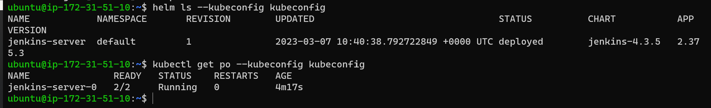

Deescribe the pod

```bash
kubectl describe po --kubeconfig kubeconfig
```
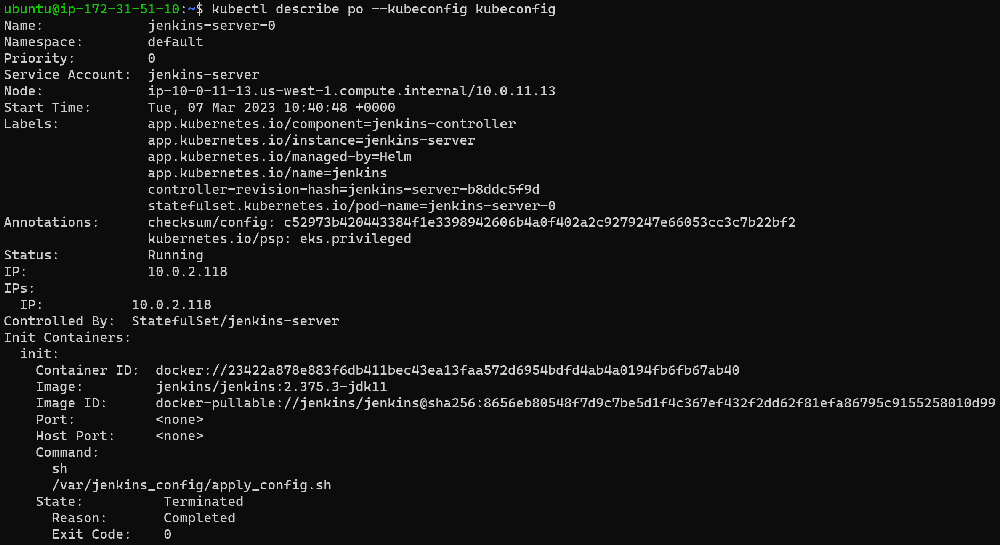

For Multi cluster management merge all the kubeconfig files together using a kubectl plugin kofig.

- Install Kubectl plugin manager [krew](https://krew.sigs.k8s.io/docs/user-guide/setup/install/)


Install the konfig plugin

```bash
kubectl krew install konfig
```


Import the kubeconfig into the default kubeconfig file. 

```bash
# Merge kubeconfig file into the default config file
  kubectl konfig import --save  [kubeconfig file]

  # Show all the contexts
  k config get-contexts

  # Set the current context to use for all kubectl and helm commands
  kubectl config use-context [name of EKS cluster]
```

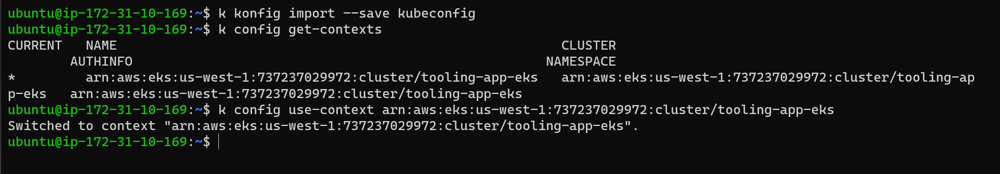

Test that it is working without specifying the --kubeconfig flag

```bash
# Display pods
k get pod

# Display the current context
k config current-context
```

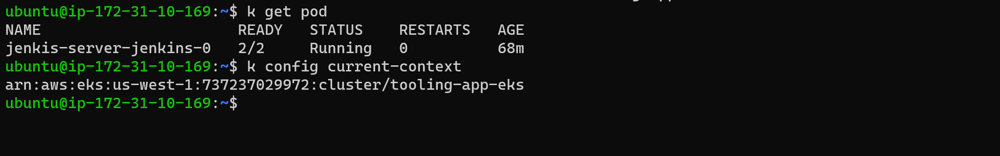

Get the password to the admin user using the instructions displayed when jenkins chart was installed See snapshoot above - *Install Jenkins chart*

```bash
# Get password
kubectl exec --namespace default -it svc/jenkins-server -c jenkins -- /bin/cat /run/secrets/additional/chart-admin-password && echo

#  Get the Jenkins URL 
kubectl --namespace default port-forward svc/jenkins-server 8080:8080
```

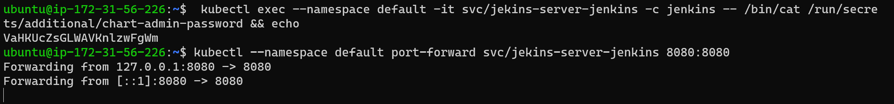
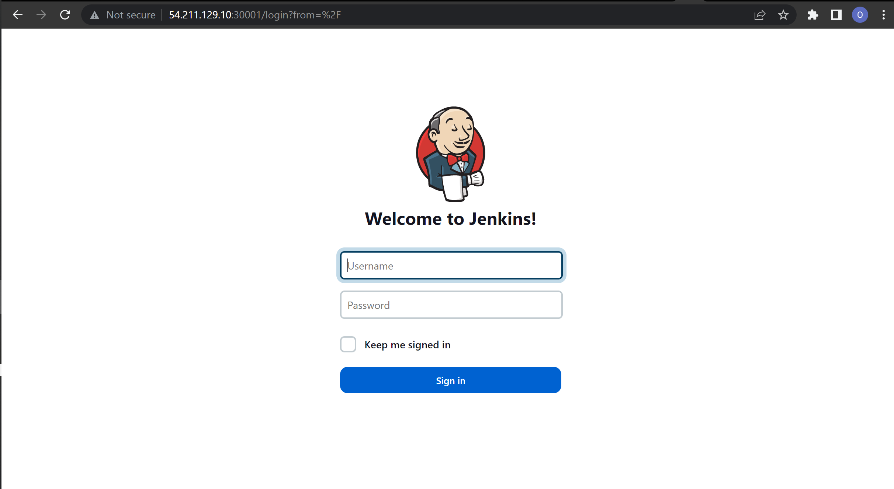

Install Artifactory

```bash
# Add JFrog Helm repository
helm repo add jfrog https://charts.jfrog.io
helm repo update

# To install the chart with the release name artifactory
helm upgrade --install artifactory --namespace default jfrog/artifactory

```

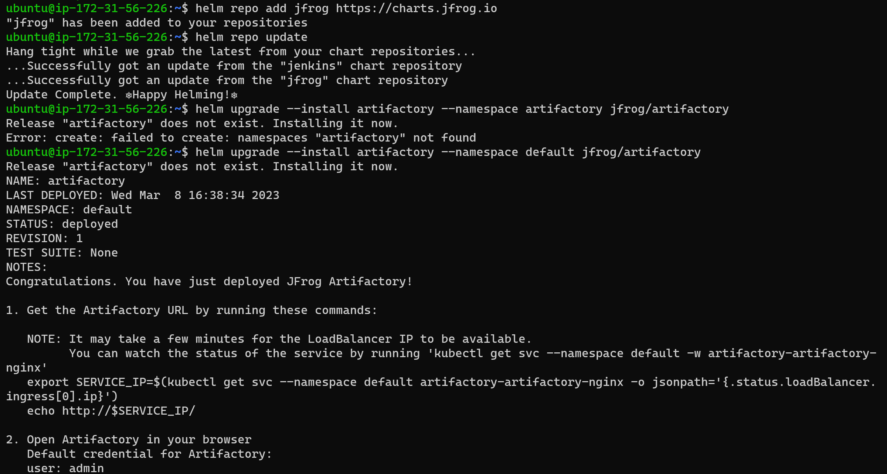

Prometheus Setup with Helm

```bash
# Get Repository Info
helm repo add prometheus-community https://prometheus-community.github.io/helm-charts

helm repo update

# Install Chart
helm install prome prometheus-community/prometheus
```

> *Create NodePort Service object and expose pod port 9090 on nodeport port 30005*

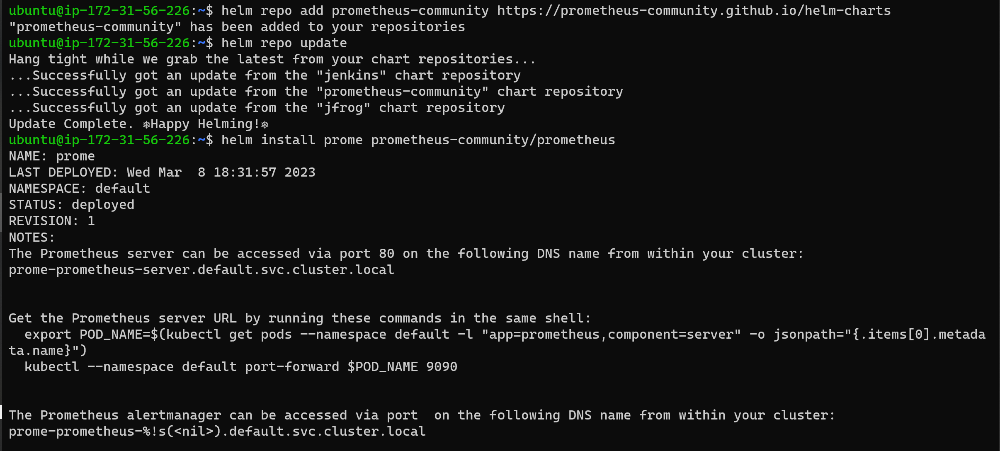

View in the browser
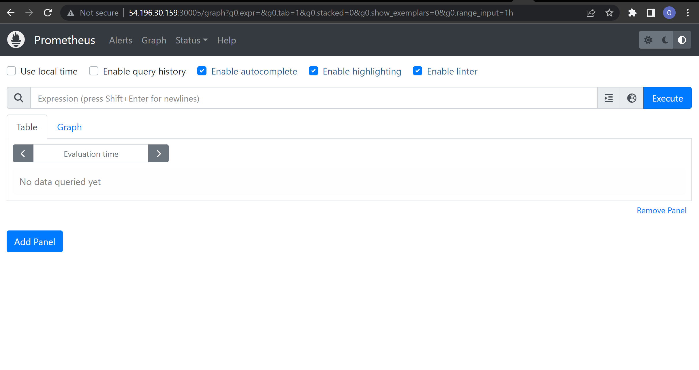

Grafana Setup with Helm

```bash
# Get Repo Info
helm repo add grafana https://grafana.github.io/helm-charts
helm repo update

# Installing the Chart
helm install mygrafana grafana/grafana

```

> *Create NodePort Service object and expose pod port 3000 on nodeport port 30006*
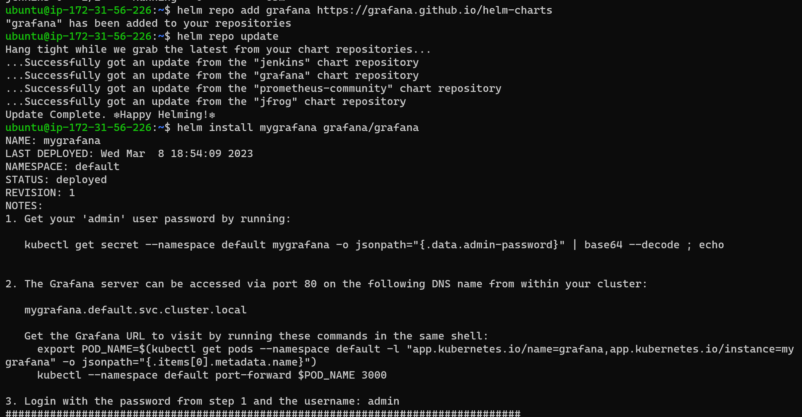

View in the browser
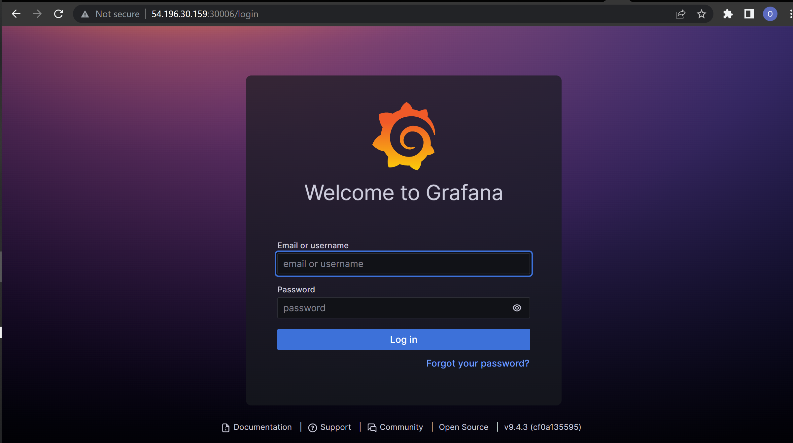

Elasticsearch ELK Setup with Helm using ECK

```bash
helm repo add elastic https://helm.elastic.co
helm repo update
