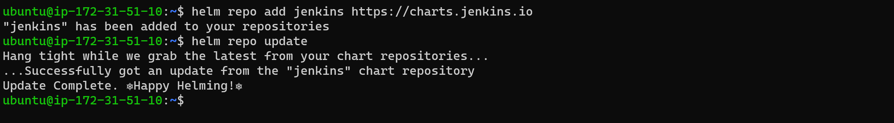
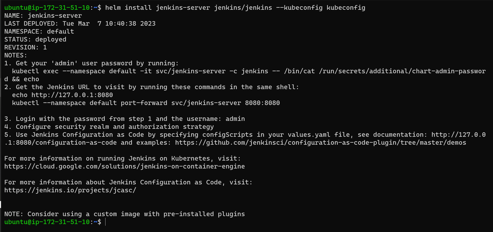

# BUILDING ELASTIC KUBERNETES SERVICE (EKS) WITH TERRAFORM AND DEPLOYMENT WITH HELM

View Terraform EKS cluster configuration files here

Install Helm on a Windows OS

```bash
choco install kubernetes-helm
```


Get Jekins helm chart from [Artifact Hub](https://artifacthub.io/packages/helm/jenkinsci/jenkins)

```bash
# Add the repository to helm so that you can easily download and deploy
helm repo add jenkins https://charts.jenkins.io

# Update helm repo
helm repo update
```



```bash
# Install the chart
helm install [RELEASE_NAME] jenkins/jenkins --kubeconfig [kubeconfig file]
```
